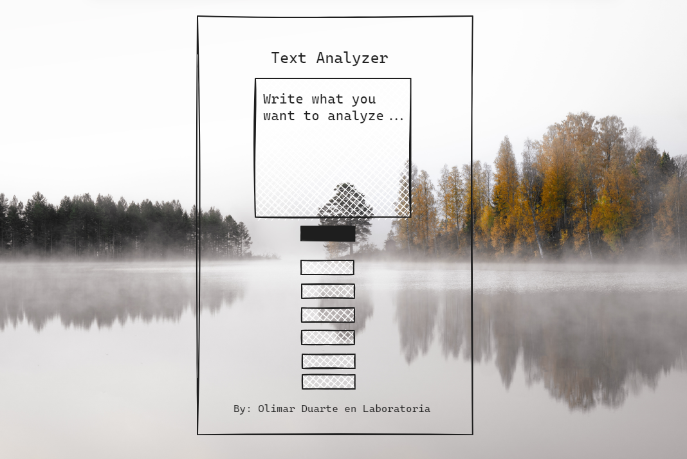

# Analizador de texto

<p align="center">
  
  
  
  
  
  
  

   
</p>

## Índice

* [1. Consideraciones generales](#1-consideraciones-generales)
* [2. Preámbulo](#2-preámbulo)
* [3. Resumen del proyecto](#3-resumen-del-proyecto)
* [4. Funcionalidades](#4-funcionalidades)
* [5. Boilerplate](#5-boilerplate)
* [6. Algunos criterios de aceptación mínimos del proyecto](#6-criterios-de-aceptación-mínimos-del-proyecto)
* [7. Pruebas](#7-pruebas)
* [8. Objetivos de aprendizaje](#8-objetivos-de-aprendizaje)
* [9. Algunos conceptos aplicados](#9-algunos-conceptos-aplicados)

***

## 1. Consideraciones generales

* Este proyecto fue realizado dentro del marco de bootcamp de desarrollo web impusado por https://www.laboratoria.la/.
* Fue resuelto de manera **individual**.
* El rango de tiempo fue 1 Sprint y 3 días.

## 2. Preámbulo


Un analizador de texto es una aplicación para extraer información útil de un
texto utilizando diversas técnicas.

En general, las aplicaciones de análisis de texto brindan información
valiosa y métricas sobre los textos que pueden ayudar a las usuarias a
tomar decisiones informadas y sacar conclusiones significativas.
Mediante el uso de estas herramientas de análisis, las usuarias pueden
obtener una comprensión más profunda de los textos.

## 3. Resumen del proyecto

En este proyecto se creó una aplicación web que servirá para que la usuaria
pueda analizar un texto en el navegador mostrando una serie de indicadores y
métricas específicas sobre caracteres, letras, números, etc. Que hayan sido
enviadas como _input_ por ella. Se hizo utilizando HTML, CSS y JavaScript.

## 4. Funcionalidades

El listado de funcionalidades es el siguiente:

1. La aplicación permite a la usuaria ingresar un texto escribiéndolo
en un cuadro de texto.

2. La aplicación calcula las siguientes métricas y actualiza el
resultado en tiempo real a medida que la usuaria escribe su texto:

    - **Recuento de palabras**: cuenta el número de palabras en el texto 
    de entrada y muestra este recuento a la usuaria
    - **Recuento de caracteres**: cuenta el número de caracteres en el texto de 
    entrada, incluidos espacios y signos de puntuación, y muestra este recuento 
    a la usuaria.
    - **Recuento de caracteres excluyendo espacios y signos de puntuación**:
    cuenta el número de caracteres en el texto de entrada, excluyendo espacios 
    y signos de puntuación, y muestra este recuento a la usuaria.
    - **Recuento de números**: cuenta cúantos números hay en el texto de entrada 
    y muestra este recuento a la usuaria.
    - **Suma total de números**: suma todos los números que hay en el texto de 
    entrada y muestra el resultado a la usuaria.
    - **Longitud media de las palabras**: calcula la longitud media de las 
    palabras en el texto de entrada y los muestra a la usuaria.

3. La aplicación permite limpiar el contenido de la caja de texto haciendo
clic en un botón.

## 5. Boilerplate

La lógica del proyecto está implementada completamente en JavaScript. En
este proyecto NO estaba permitido usar librerías o frameworks, solo JavaScript
puro también conocido como Vanilla JavaScript.

El boilerplate recibido contiene la siguiente estructura estructura:

```text
./
├── .babelrc
├── .editorconfig
├── .eslintrc
├── .gitignore
├── README.md
├── package.json
├── src
│   ├── analyzer.js
│   ├── index.html
│   ├── index.js
│   └── style.css
└── test
    ├── .eslintrc
    └── analyzer.spec.js
```
***

  Como ejemplo de uso que se esperaba de cada función, Laboratoria recomendó ver el archivo
  [`test/analyzer.spec.js`](./test/analyzer.spec.js).

  En este proyecto, se utiliza _Github Pages_ para desplegar nuestro sitio web (Deploy).

***

## 6.Algunos criterios de aceptación mínimos del proyecto

A continuación ese encuentran los criterios de aceptación mínimos del proyecto
relacionados con cada objetivo de aprendizaje.

### HTML

* **Uso de HTML semántico**

  - [x] La aplicación tiene un encabezado conformado por un
  [`<header>`](https://developer.mozilla.org/en-US/docs/Web/HTML/Element/header)
  que es padre de un
  [`<h1>`](https://developer.mozilla.org/en-US/docs/Web/HTML/Element/h1)
  con texto `Analizador de texto`. Para que puedas practicar más, estos
  elementos no pueden tener atributos `id`, ni `name`, ni `class`.

  - [x] La aplicación usa un
  [`<textarea>`](https://developer.mozilla.org/en-US/docs/Web/HTML/Element/textarea)
  con un el atributo `name` en el valor `user-input` para permitir a la usuaria
  ingresar un texto. Para que puedas practicar más, este elemento no puede
  tener atributos `id`, ni `class`.

  - [x] La aplicación usa un
  [`<ul>`](https://developer.mozilla.org/en-US/docs/Web/HTML/Element/ul)
  con 6 hijos [`<li>`](https://developer.mozilla.org/en-US/docs/Web/HTML/Element/li),
  uno para mostrar cada métrica.  Para que puedas practicar más, estos
  elementos no pueden tener atributos `id` ni `name` ni hijos.

  - [x] El [`<li>`](https://developer.mozilla.org/en-US/docs/Web/HTML/Element/li)
  para mostrar el _recuento de palabras_ debe tener un atributo
  `data-testid` con valor `word-count`.

  - [x] El [`<li>`](https://developer.mozilla.org/en-US/docs/Web/HTML/Element/li)
  para mostrar el _recuento de caracteres_ debe tener un atributo
  `data-testid` con valor `character-count`.

  - [x] El [`<li>`](https://developer.mozilla.org/en-US/docs/Web/HTML/Element/li)
  para mostrar el
  _recuento de caracteres excluyendo espacios y signos de puntuación_
  debe tener un atributo
  `data-testid` con valor `character-no-spaces-count`.

  - [x] El [`<li>`](https://developer.mozilla.org/en-US/docs/Web/HTML/Element/li)
  para mostrar el _recuento de números_ debe tener un atributo
  `data-testid` con valor `number-count`.

  - [x] El [`<li>`](https://developer.mozilla.org/en-US/docs/Web/HTML/Element/li)
  para mostrar la _suma total de números_ debe tener un atributo
  `data-testid` con valor `number-sum`.

  - [x] El [`<li>`](https://developer.mozilla.org/en-US/docs/Web/HTML/Element/li)
  para mostrar la _longitud media de palabras_ debe tener un atributo
  `data-testid` con valor `word-length-average`.

  - [x] La aplicación tiene un pie de página conformado por un
  [`<footer>`](https://developer.mozilla.org/en-US/docs/Web/HTML/Element/footer)
  que es padre de un
  [`<p>`](https://developer.mozilla.org/en-US/docs/Web/HTML/Element/p)
  que tiene como texto el nombre de la estudiante desarrolladora de la aplicación.
  Para que puedas practicar más, estos elementos no pueden
  tener atributos `id`, ni `name`, ni `class`.

  - [x] La aplicación usa un
  [`<button>`](https://developer.mozilla.org/en-US/docs/Web/HTML/Element/button)
  con el atributo `id` en el valor `reset-button` para permitir a la usuaria,
  mediante un clic, limpiar el contenido de la caja de texto.

### CSS

* **Uso de selectores de CSS**

  - [x] La aplicación usa
  [`selectores CSS de tipo`](https://developer.mozilla.org/en-US/docs/Learn/CSS/Building_blocks/Selectors/Type_Class_and_ID_Selectors#type_selectors)
  para darle estilo al
  [`<header>`](https://developer.mozilla.org/en-US/docs/Web/HTML/Element/header)
  y al
  [`<footer>`](https://developer.mozilla.org/en-US/docs/Web/HTML/Element/footer).

  - [x] La aplicación usa
  [`selectores CSS de class`](https://developer.mozilla.org/en-US/docs/Learn/CSS/Building_blocks/Selectors/Type_Class_and_ID_Selectors#class_selectors)
  para darle estilo a los
  [`<li>`](https://developer.mozilla.org/en-US/docs/Web/HTML/Element/li)
  descrito anteriormente.

  - [x] La aplicación usa
  [`selectores de atributo`](https://developer.mozilla.org/en-US/docs/Learn/CSS/Building_blocks/Selectors/Attribute_selectors)
  para darle estilo al
  [`<textarea>`](https://developer.mozilla.org/en-US/docs/Web/HTML/Element/textarea)
  usando el atributo `name`.

  - [x] La aplicación usa
  [`selectores CSS de ID`](https://developer.mozilla.org/en-US/docs/Learn/CSS/Building_blocks/Selectors/Type_Class_and_ID_Selectors#id_selectors)
  para darle estilo al
  [`<button>`](https://developer.mozilla.org/en-US/docs/Web/HTML/Element/button)
  con el atributo `id` en el valor `reset-button`.

* **Modelo de caja (box model): border, margen, padding**

  - [x] Las
  [`clases css`](https://developer.mozilla.org/en-US/docs/Learn/CSS/Building_blocks/Selectors/Type_Class_and_ID_Selectors#class_selectors)
  de los
  [`<li>`](https://developer.mozilla.org/en-US/docs/Web/HTML/Element/li)
  hijos del
  [`<ul>`](https://developer.mozilla.org/en-US/docs/Web/HTML/Element/ul)
  definen un estilo usando las propiedades del
  [modelo de caja](https://cssreference.io/box-model/),
  ([`background`](https://cssreference.io/backgrounds/),
  `border`,
  [`margin`](https://cssreference.io/property/margin/),
  [`padding`](https://cssreference.io/property/padding/)).

### Web APIs

* **Uso de selectores del DOM**

  - [x] La aplicación usa el
  [`selector del DOM querySelector`](https://developer.mozilla.org/en-US/docs/Web/API/Document/querySelector).

  - [x] La aplicación usa el
  [`selector del DOM getElementById`](https://developer.mozilla.org/en-US/docs/Web/API/Document/getElementById).

* **Manejo de eventos del DOM (listeners, propagación, delegación)**

  - [x] La aplicación registra un
  [Event Listener](https://developer.mozilla.org/en/docs/Web/API/EventTarget/addEventListener)
  para escuchar el evento `input` del `<textarea>` para actualizar las métricas
  cuando se haga escriba en el cuadro de texto.

  - [x] La aplicación registra un
  [Event Listener](https://developer.mozilla.org/en/docs/Web/API/EventTarget/addEventListener)
  para escuchar el evento `click` del `<button>` que limpia el contenido de la
  caja de texto.

* **Manipulación dinámica del DOM**
  - [x] La aplicación actualiza el atributo
  [`textContent`](https://developer.mozilla.org/es/docs/Web/API/Node/textContent)
  o
  [`innerHTML`](https://developer.mozilla.org/es/docs/Web/API/Element/innerHTML)
  de los `<li>` que mostrar las métricas del texto.

### JavaScript

* **Tipos de datos primitivos**

  - [x] La aplicación convierte valores tipo `string` a tipo `number`.

* **Strings (cadenas de caracteres)**

  - [x] La aplicación usa métodos para manipular strings como
  [`split`](https://developer.mozilla.org/en-US/docs/Web/JavaScript/Reference/Global_Objects/String/split),
  [`trim`](https://developer.mozilla.org/en-US/docs/Web/JavaScript/Reference/Global_Objects/String/trim)
  o
  [`replace`](https://developer.mozilla.org/en-US/docs/Web/JavaScript/Reference/Global_Objects/String/replace).

* **Variables (declaración, asignación, ámbito)**

  - [x] La aplicación declara variables con
  [`let`](https://developer.mozilla.org/en-US/docs/Web/JavaScript/Reference/Statements/let)
  y
  [`const`](https://developer.mozilla.org/en-US/docs/Web/JavaScript/Reference/Statements/const).

  - [x] La aplicación NO declara variables con  `var`.

* **Uso de condicionales (if-else, switch, operador ternario, lógica booleana)**

  - [x] La aplicación usa el statement
  [`if..else`](https://developer.mozilla.org/en-US/docs/Web/JavaScript/Reference/Statements/if...else)
  para evaluar condiciones.

* **Uso de bucles/ciclos (while, for, for..of)**

  - [x] La aplicación usa el statement
  [`for`](https://developer.mozilla.org/en-US/docs/Web/JavaScript/Reference/Statements/for)
  para crear un bucle.

* **Pruebas unitarias (unit tests)**

  - [x] Se pasan todas las pruebas unitarias.

* **Uso de identificadores descriptivos (Nomenclatura y Semántica)**

  - [x] En el código se utilizan identificadores descriptivos para variables
  y funciones.

### Centrado en la usuaria

* **Diseñar y desarrollar un producto o servicio poniendo a las
usuarias en el centro**

Para lograrlo se realizó un diseño sencillo, pensando en que su contenido estuviera en inglés, fuese lo más "minimal" posible y también mostrara cierta elegancia. Para una usuaria práctica, adulto contemporánea y con sensibilidad por la estética.

### Diseño de producto

* **Diseñar en distintos niveles de fidelidad**

  - [x] La estudiante creó prototipos de baja fidelidad para la UI (interfaz gŕafica).

El prototipo de baja fidelidad fue representado usando la aplicación excalidraw:



## 7. Pruebas

### Pruebas de criterios mínimos de aceptación

Se ejecutaron las pruebas de cada grupo de objetivos de aprendizaje de
manera individual con los siguientes comandos:

* `npm run test:oas-html`
* `npm run test:oas-css`
* `npm run test:oas-web-api`
* `npm run test:oas-js`

#### Pruebas end-to-end

Una prueba end-to-end (E2E) es una técnica de prueba de software en la que
se verifica el funcionamiento de todo el sistema desde el inicio hasta el
final. En otras palabras, se prueba el flujo completo del software, simulando
la interacción de la usuaria con la aplicación, para asegurarse de que todas
las partes del sistema funcionan correctamente en conjunto.

Se ejecutaron estas pruebas con el comando `npm run test:e2e` 

### Github actions

Este repositorio usa una GitHub Action para ejecutar automáticamente
las pruebas unitarias, pruebas de criterios mínimos de aceptación y
y pruebas end-to-end cada vez que se haga un _push_ en la rama
_main_ del repositorio.

Se puede consultar el resultado de esta Github Action
en la pestaña _Actions_ del repositorio en Github.

## 8. Objetivos de aprendizaje

Objetivos marcados después de la reflexión, después de comprendidos y aplicados en el proyecto. Fueron esenciales al decidir la estrategia de trabajo.

### HTML

- [x] **Uso de HTML semántico**

  <details><summary>Links</summary><p>

  * [HTML semántico](https://curriculum.laboratoria.la/es/topics/html/html5/semantic-html)
  * [Semantics - MDN Web Docs Glossary](https://developer.mozilla.org/en-US/docs/Glossary/Semantics#Semantics_in_HTML)
</p></details>

### CSS

- [x] **Uso de selectores de CSS**

  <details><summary>Links</summary><p>

  * [Intro a CSS](https://curriculum.laboratoria.la/es/topics/css/css/intro-css)
  * [CSS Selectors - MDN](https://developer.mozilla.org/es/docs/Web/CSS/CSS_Selectors)
</p></details>

- [x] **Modelo de caja (box model): borde, margen, padding**

  <details><summary>Links</summary><p>

  * [Box Model & Display](https://curriculum.laboratoria.la/es/topics/css/css/boxmodel-and-display)
  * [The box model - MDN](https://developer.mozilla.org/en-US/docs/Learn/CSS/Building_blocks/The_box_model)
  * [Introduction to the CSS box model - MDN](https://developer.mozilla.org/en-US/docs/Web/CSS/CSS_Box_Model/Introduction_to_the_CSS_box_model)
  * [CSS display - MDN](https://developer.mozilla.org/pt-BR/docs/Web/CSS/display)
  * [display - CSS Tricks](https://css-tricks.com/almanac/properties/d/display/)
</p></details>

### Web APIs

- [x] **Uso de selectores del DOM**

  <details><summary>Links</summary><p>

  * [Manipulación del DOM](https://curriculum.laboratoria.la/es/topics/browser/dom/1-dom-methods-selection)
  * [Introducción al DOM - MDN](https://developer.mozilla.org/es/docs/Web/API/Document_Object_Model/Introduction)
  * [Localizando elementos DOM usando selectores - MDN](https://developer.mozilla.org/es/docs/Web/API/Document_object_model/Locating_DOM_elements_using_selectors)
</p></details>

- [x] **Manejo de eventos del DOM (listeners, propagación, delegación)**

  <details><summary>Links</summary><p>

  * [Introducción a eventos - MDN](https://developer.mozilla.org/es/docs/Learn/JavaScript/Building_blocks/Events)
  * [EventTarget.addEventListener() - MDN](https://developer.mozilla.org/es/docs/Web/API/EventTarget/addEventListener)
  * [EventTarget.removeEventListener() - MDN](https://developer.mozilla.org/es/docs/Web/API/EventTarget/removeEventListener)
  * [El objeto Event](https://developer.mozilla.org/es/docs/Web/API/Event)
</p></details>

- [x] **Manipulación dinámica del DOM**

  <details><summary>Links</summary><p>

  * [Introducción al DOM](https://developer.mozilla.org/es/docs/Web/API/Document_Object_Model/Introduction)
  * [Node.appendChild() - MDN](https://developer.mozilla.org/es/docs/Web/API/Node/appendChild)
  * [Document.createElement() - MDN](https://developer.mozilla.org/es/docs/Web/API/Document/createElement)
  * [Document.createTextNode()](https://developer.mozilla.org/es/docs/Web/API/Document/createTextNode)
  * [Element.innerHTML - MDN](https://developer.mozilla.org/es/docs/Web/API/Element/innerHTML)
  * [Node.textContent - MDN](https://developer.mozilla.org/es/docs/Web/API/Node/textContent)
</p></details>

### JavaScript

- [x] **Tipos de datos primitivos**

  <details><summary>Links</summary><p>

  * [Valores primitivos - MDN](https://developer.mozilla.org/es/docs/Web/JavaScript/Data_structures#valores_primitivos)
</p></details>

- [x] **Strings (cadenas de caracteres)**

  <details><summary>Links</summary><p>

  * [Strings](https://curriculum.laboratoria.la/es/topics/javascript/strings)
  * [String — Cadena de caracteres - MDN](https://developer.mozilla.org/es/docs/Web/JavaScript/Reference/Global_Objects/String)
</p></details>

- [x] **Variables (declaración, asignación, ámbito)**

  <details><summary>Links</summary><p>

  * [Valores, tipos de datos y operadores](https://curriculum.laboratoria.la/es/topics/javascript/basics/values-variables-and-types)
  * [Variables](https://curriculum.laboratoria.la/es/topics/javascript/basics/variables)
</p></details>

- [x] **Uso de condicionales (if-else, switch, operador ternario, lógica booleana)**

  <details><summary>Links</summary><p>

  * [Estructuras condicionales y repetitivas](https://curriculum.laboratoria.la/es/topics/javascript/flow-control/conditionals-and-loops)
  * [Tomando decisiones en tu código — condicionales - MDN](https://developer.mozilla.org/es/docs/Learn/JavaScript/Building_blocks/conditionals)
</p></details>

- [x] **Uso de bucles/ciclos (while, for, for..of)**

  <details><summary>Links</summary><p>

  * [Bucles (Loops)](https://curriculum.laboratoria.la/es/topics/javascript/flow-control/loops)
  * [Bucles e iteración - MDN](https://developer.mozilla.org/es/docs/Web/JavaScript/Guide/Loops_and_iteration)
</p></details>

- [x] **Funciones (params, args, return)**

  <details><summary>Links</summary><p>

  * [Funciones (control de flujo)](https://curriculum.laboratoria.la/es/topics/javascript/flow-control/functions)
  * [Funciones clásicas](https://curriculum.laboratoria.la/es/topics/javascript/functions/classic)
  * [Arrow Functions](https://curriculum.laboratoria.la/es/topics/javascript/functions/arrow)
  * [Funciones — bloques de código reutilizables - MDN](https://developer.mozilla.org/es/docs/Learn/JavaScript/Building_blocks/Functions)
</p></details>

- [x] **Pruebas unitarias (unit tests)**

  <details><summary>Links</summary><p>

  * [Empezando con Jest - Documentación oficial](https://jestjs.io/docs/es-ES/getting-started)
</p></details>

- [x] **Módulos de ECMAScript (ES Modules)**

  <details><summary>Links</summary><p>

  * [import - MDN](https://developer.mozilla.org/es/docs/Web/JavaScript/Reference/Statements/import)
  * [export - MDN](https://developer.mozilla.org/es/docs/Web/JavaScript/Reference/Statements/export)
</p></details>

- [x] **Uso de linter (ESLINT)**

- [x] **Uso de identificadores descriptivos (Nomenclatura y Semántica)**

### Control de Versiones (Git y GitHub)

- [x] **Git: Instalación y configuración**

- [x] **Git: Control de versiones con git (init, clone, add, commit, status, push, pull, remote)**

- [x] **GitHub: Creación de cuenta y repos, configuración de llaves SSH**

- [x] **GitHub: Despliegue con GitHub Pages**

  <details><summary>Links</summary><p>

  * [Sitio oficial de GitHub Pages](https://pages.github.com/)
</p></details>

### Centrado en el usuario

- [x] **Diseñar y desarrollar un producto o servicio poniendo a las usuarias en el centro**

### Diseño de producto

- [x] **Diseñar en distintos niveles de fidelidad**

- [x] **Seguir los principios básicos de diseño visual**

## 9 Algunos conceptos aplicados

### Web APIs y JavaScript:

- `Number()`: Función que convierte un valor a un número. Sintaxis: ``Number(anyValue);``
- `.parseFloat()`: Función que convierte una cadena a un número de punto flotante. Sintaxis: ``parseFloat(anyString);``
- `console.log`: Función que muestra mensajes en la consola. Sintaxis: ``console.log(anyMessage);``

  - **Métodos**:
- `document.querySelector`: Método que busca y devuelve el primer elemento que coincide con un selector CSS. Sintaxis: ``document.querySelector(anySelector);``
- `document.getElementById`: Método que obtiene un elemento del DOM por su ID. Sintaxis: ``document.getElementById(id)``
- `.addEventListener`: Método que agrega un escucha de eventos a un elemento. Sintaxis:``addEventListener(type, listener)``
- `.split()`: Método que divide una cadena en un array de subcadenas. Sintaxis: ``split(separator)``
- `.trim()`: Método que elimina espacios en blanco al principio y al final de una cadena. Sintaxis: ``trim()``
- `.replace()`: Método que reemplaza parte de una cadena con otra. Sintaxis: ``replace(pattern, replacement)``
- `.toFixed()`: Método que redondea un número al número especificado de decimales. Sintaxis: ``toFixed(digits)``
- `.match()`: Método que busca una cadena para una coincidencia con una expresión regular. Sintaxis: ``match(regexp)``

  - **Atributos**:
- `.value`: Atributo que obtiene o establece el valor de un elemento de formulario.
- `.placeholder`: Atributo especifica un texto de ayuda en un campo de entrada.

  - **Propiedades**:
- `.length`: Propiedad que devuelve la longitud de una cadena o array.
- `.textContent`: Propiedad obtiene o establece el contenido de texto de un elemento.

  - **Otros elementos clave**:
- `if-else`: Estructura condicional para tomar decisiones.
- `for`: Palabra clave para bucles de repetición.
- `"click"`: Tipo de evento que ocurre al hacer clic en un elemento.
- `"input"`: es una etiqueta HTML que crea controles interactivos en formularios web, como campos de texto, casillas de verificación o botones. Se utiliza para recopilar información del usuario mediante la entrada de datos.
- `:nth-child()`: Selector de CSS para seleccionar elementos según su posición en relación con sus padres.
- `$`: Sintaxis para template literals 
- `[i]`: Sintaxis de acceso a un elemento de array por índice.
- `===`: Operador de igualdad estricta.
- `=>`: Operador de función flecha.


['../img/prototipo-de-baja-fidelidad.png]: '../img/prototipo-de-baja-fidelidad.png
['../img/resultado.png]: '../img/resultado.png
